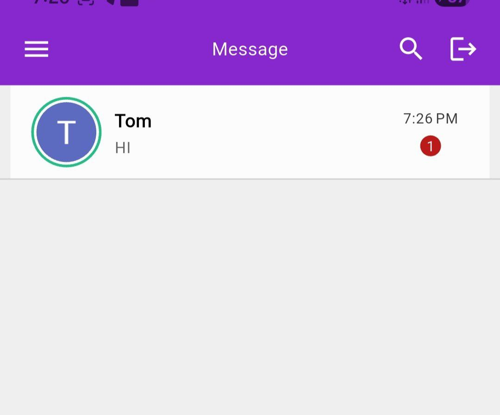
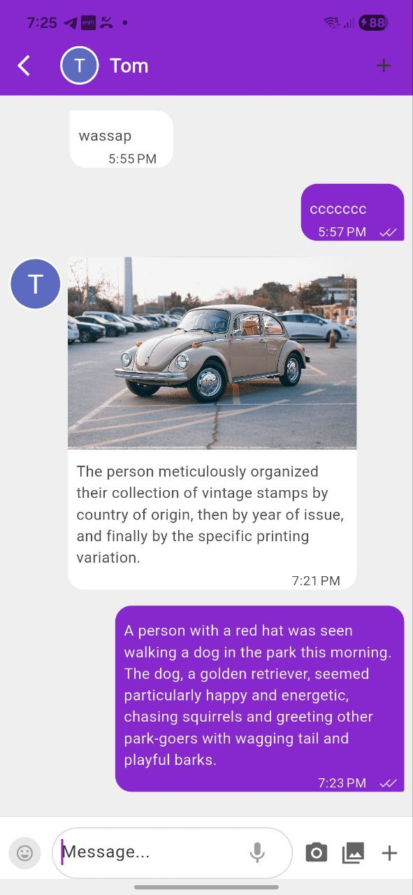
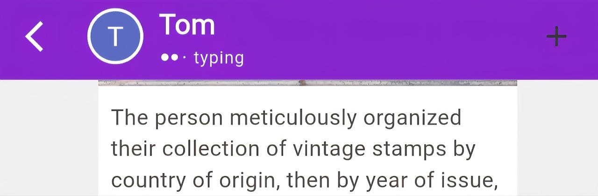

# Enkoy Chat - Real-Time Messaging Application

A production-ready Flutter chat application built with real-time messaging capabilities, user authentication, and modern UI/UX design. This project demonstrates clean architecture, state management best practices, and integration with Firebase services.


---

## 📸 Screenshots

<div align="center">
  
  
  
</div>

---

## ✨ Features

### ✅ Implemented Features

#### **Authentication & User Management**

- ✅ Email/Password authentication
- ✅ Google Sign-In integration
- ✅ User registration with account creation
- ✅ Automatic user session management
- ✅ User profile management

#### **Real-Time Messaging**

- ✅ Real-time message sending and receiving via Cloud Firestore
- ✅ Instant message delivery without manual refresh
- ✅ Conversation-style UI with chat bubbles
- ✅ Auto-scroll to newest messages
- ✅ Formatted timestamps for each message
- ✅ Message grouping by date

#### **Chat Features**

- ✅ Chat list screen with all conversations
- ✅ Message status indicators (Sent/Delivered/Seen)
- ✅ Unseen message count badges
- ✅ Typing indicators in real-time
- ✅ Online/offline status tracking
- ✅ User search functionality
- ✅ Image sharing with captions
- ✅ Image compression before upload

#### **User Interface**

- ✅ Material Design 3 with custom theming
- ✅ Clean, modern UI with purple color scheme
- ✅ Google Fonts (Roboto) integration
- ✅ Loading states and error handling
- ✅ Empty state handling
- ✅ Responsive design

#### **Notifications**

- ✅ Firebase Cloud Messaging (FCM) integration
- ✅ Awesome Notifications for local notifications
- ✅ Foreground and background notification handling
- ✅ Notification permissions handling
- ⚠️ Backend push notification setup (client ready, backend configuration needed)

#### **Technical Features**

- ✅ Clean architecture with separation of concerns
- ✅ Stacked framework for state management
- ✅ Repository pattern implementation
- ✅ Dependency injection with Stacked locator
- ✅ Code generation with Freezed and JSON Serializable
- ✅ Type-safe models and enums

---

## ❌ Not Implemented Features

The following features are planned but not yet implemented:

### **Chat Functionality**

- ❌ Message editing and deletion
- ❌ Audio message support (enum exists but not implemented)
- ❌ Video message support (enum exists but not implemented)
- ❌ Document/file sharing
- ❌ Message pagination for large conversations
- ❌ Message caching for offline support

### **Communication**

- ❌ Audio calling
- ❌ Video calling

### **Authentication**

- ❌ Facebook login (stub exists)
- ❌ GitHub login (stub exists)
- ❌ Forgot password functionality (stub exists)

### **Advanced Features**

- ❌ Backend push notification server setup (client is ready)
- ❌ Message reactions/emojis
- ❌ Group chats
- ❌ Chat backup/export
- ❌ Block user functionality
- ❌ Message forwarding

---

## 🛠️ Tools & Technologies

### **Core Framework**

- **Flutter SDK** `>=3.0.3 <4.0.0` - Cross-platform UI framework
- **Dart** - Programming language

### **State Management & Architecture**

- **Stacked** `^3.4.0` - State management and architecture framework
- **Stacked Services** `^1.1.0` - Navigation, dialogs, and bottom sheets
- **Stacked Generator** `^1.3.3` - Code generation for routes and dependencies

### **Backend Services**

- **Firebase Core** `^4.2.0` - Firebase initialization
- **Cloud Firestore** `^6.0.3` - Real-time database for messages
- **Firebase Auth** `^6.1.1` - User authentication
- **Firebase Realtime Database** `^12.0.3` - Online status and typing indicators
- **Firebase Messaging** `^16.0.3` - Push notifications
- **Firebase Storage** `^13.0.3` - File storage (optional, using Cloudinary instead)

### **Authentication**

- **Google Sign In** `^6.1.0` - Google OAuth integration

### **Storage & Media**

- **Cloudinary Public** `^0.23.1` - Cloud-based image hosting
- **Image Picker** `^1.2.0` - Image selection from gallery/camera
- **File Picker** `^10.3.3` - File selection
- **Flutter Image Compress** `^2.4.0` - Image compression
- **Cached Network Image** `^3.4.1` - Efficient image caching

### **UI & Styling**

- **Flex Color Scheme** `^8.3.1` - Material Design 3 theming
- **Google Fonts** `^6.3.2` - Custom typography
- **Flutter SpinKit** `^5.2.2` - Loading animations
- **Flutter Toast** `^8.2.14` - Toast notifications

### **Notifications**

- **Awesome Notifications** `^0.10.1` - Local notification management

### **Utilities**

- **Shared Preferences** `^2.5.3` - Local data persistence
- **Permission Handler** `^12.0.1` - Runtime permissions
- **Device Info Plus** `^12.2.0` - Device information
- **NB Utils** `^7.1.8` - Utility functions
- **Collection** `^1.19.1` - Collections utilities

### **Code Generation**

- **Build Runner** `^2.4.13` - Code generation runner
- **Freezed** `^2.5.2` - Immutable classes generation
- **Freezed Annotation** `^2.4.4` - Freezed annotations
- **JSON Serializable** `^6.8.0` - JSON serialization
- **JSON Annotation** `^4.9.0` - JSON annotations

### **Testing**

- **Flutter Test** - Unit and widget testing
- **Mockito** `^5.4.1` - Mocking framework
- **Golden Toolkit** `^0.15.0` - Golden file testing
- **Flutter Lints** `^2.0.0` - Linting rules

### **Development Tools**

- **Git** - Version control
- **Android Studio / VS Code** - IDE support
- **Firebase Console** - Backend management

---

## 🏗️ Architecture

This project follows **Clean Architecture** principles with the **Stacked** framework:

```
lib/
├── app/                    # Application configuration
│   ├── app.locator.dart   # Dependency injection
│   ├── app.router.dart    # Navigation routes
│   ├── app.dialogs.dart   # Dialog registration
│   ├── app.bottomsheets.dart # Bottom sheet registration
│   └── app.notification.dart # Notification setup
│
├── models/                # Data models (Freezed)
│   ├── Chat.dart
│   ├── ChatConversation.dart
│   ├── ChatMessage.dart
│   └── UserAccount.dart
│
├── services/              # Business logic layer
│   ├── auth_service.dart # Authentication service
│   └── chat_service.dart # Chat operations service
│
├── interfaces/           # Service interfaces
│   └── iauth.interface.dart
│
├── enums/                # Enumerations
│   ├── chat_message_status.enum.dart
│   └── chat_message_type.enum.dart
│
├── ui/                    # Presentation layer
│   ├── views/            # Screen views
│   │   ├── auth/        # Authentication screens
│   │   ├── chat/        # Chat screens
│   │   └── startup/     # Startup/splash screen
│   ├── common/          # Reusable widgets & utilities
│   ├── dialogs/         # Dialog components
│   └── bottom_sheets/   # Bottom sheet components
│
└── main.dart             # Application entry point
```

### **Key Architectural Patterns:**

- **MVVM (Model-View-ViewModel)**: Using Stacked's BaseViewModel
- **Dependency Injection**: Service locator pattern
- **Repository Pattern**: Services abstract data access
- **Stream-based State**: Real-time updates via Firestore streams

---
