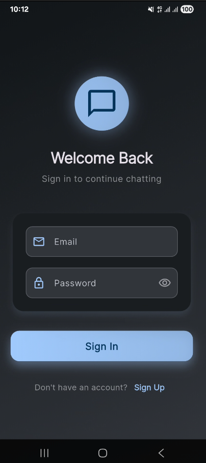
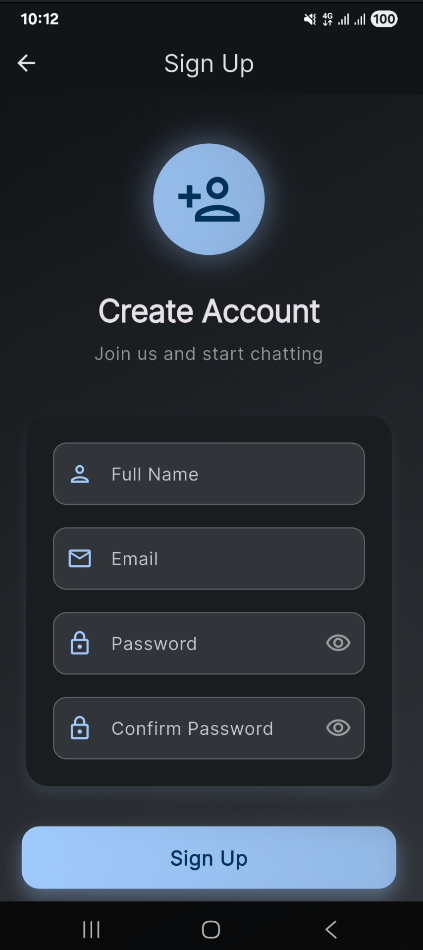
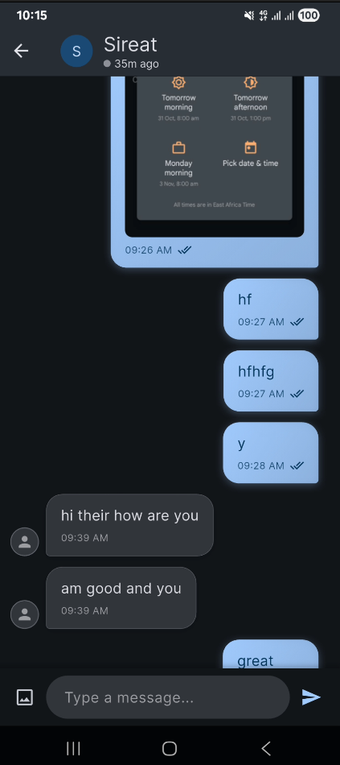
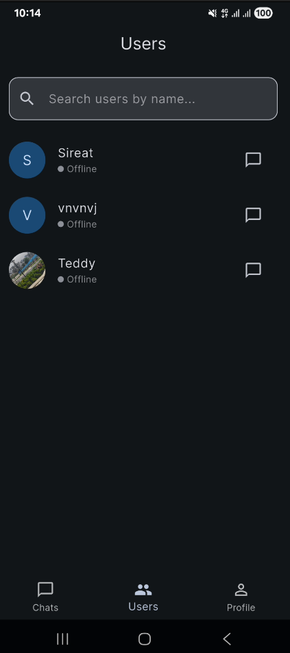
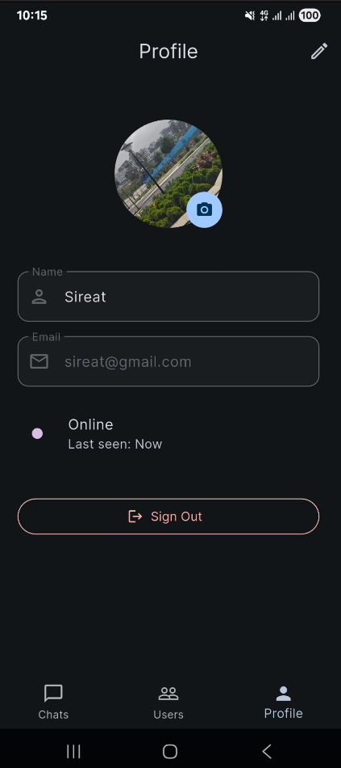

# Flutter Chat App 💬

A modern, real-time chat application built with Flutter, Firebase Authentication, and Cloud Firestore, following Clean Architecture principles. Features a beautiful Material Design 3 UI with theme-aware colors, skeleton loading states, and seamless media sharing via Cloudinary.


## ✨ Features

### 🔐 Authentication
- **Sign Up** - Create new accounts with email and password
- **Sign In** - Secure login with email validation
- **User Profile Management** - Update name and profile picture

### 💬 Real-time Chat
- **Instant Messaging** - Real-time messages using Firestore streams
- **Media Sharing** - Send images via Cloudinary integration
- **Read Receipts** - See when messages are delivered and read
- **Typing Indicators** - Know when someone is typing
- **Message Timestamps** - Formatted time display for all messages

### 👥 User Management
- **User Directory** - Browse all registered users
- **Search Functionality** - Find users by name or email
- **Online Status** - See who's online in real-time
- **Last Seen** - View when users were last active

### 🎨 User Interface
- **Modern Design** - Material Design 3 with beautiful gradients and shadows
- **Theme Support** - Light and dark mode with automatic theme switching
- **Skeleton Loading** - Elegant loading states for all pages
- **Responsive Layout** - Optimized for all screen sizes
- **Bottom Navigation** - Easy navigation between Chats, Users, and Profile

## 📸 Screenshots

<div align="center">

### Login Screen


### Sign Up Screen


### Chat List


### Chat Room


### Users Page


### Profile Page


### Loading State


</div>

## 🚀 Quick Start

### Prerequisites

- Flutter SDK (3.9.2 or higher)
- Dart SDK (3.9.2 or higher)
- Firebase account
- Cloudinary account (for media uploads)

### 1. Clone and Install

```bash
# Clone the repository
git clone <repository-url>
cd chatapp

# Install dependencies
flutter pub get
```

### 2. Setup Firebase

Follow the comprehensive guide in [FIREBASE_SETUP.md](./FIREBASE_SETUP.md)

**Quick Steps:**
```bash
# Install FlutterFire CLI
dart pub global activate flutterfire_cli

# Login to Firebase
firebase login

# Configure Firebase (generates firebase_options.dart)
flutterfire configure
```

### 3. Configure Firebase Services

In Firebase Console, enable:
- ✅ **Authentication** → Email/Password provider
- ✅ **Cloud Firestore** → Start in test mode (then apply security rules)
- ✅ Create composite indexes as needed (see [CREATE_INDEX_NOW.md](./CREATE_INDEX_NOW.md))

### 4. Setup Cloudinary

See [CLOUDINARY_SETUP.md](./CLOUDINARY_SETUP.md) for detailed instructions.

**Quick Steps:**
1. Create a Cloudinary account
2. Create an unsigned upload preset named `chatapp`
3. Configure the preset for:
   - `profile_pictures` folder
   - `chat_media` folder
4. Update `lib/core/services/cloudinary_service.dart` with your credentials

### 5. Apply Security Rules

- **Firestore Rules**: See [FIXED_FIRESTORE_RULES.md](./FIXED_FIRESTORE_RULES.md)
- **Security**: Rules enforce user authentication and proper data access

### 6. Run the App

```bash
# Run on connected device/emulator
flutter run

# Build for Android
flutter build apk

# Build for iOS
flutter build ios
```

## 📁 Project Structure

```
lib/
├── main.dart                 # App entry point with Firebase initialization
├── app.dart                  # Root app widget with theme and routing
├── config/                   # Configuration files
│   ├── app_router.dart      # Route configuration
│   └── theme.dart           # Material Design 3 theming
├── core/                     # Core utilities and services
│   ├── constants/           # App-wide constants
│   ├── services/            # External services (Cloudinary)
│   ├── utils/               # Utility functions (date formatting, validators)
│   └── widgets/             # Reusable widgets (skeletons, error display)
└── features/                # Feature modules (Clean Architecture)
    ├── auth/                # Authentication feature
    │   ├── data/            # Models and repositories
    │   ├── domain/          # Entities and use cases
    │   └── presentation/   # UI (login, signup pages)
    ├── chat/                # Chat feature
    │   ├── data/            # Chat and message models/repositories
    │   ├── domain/          # Chat entities
    │   └── presentation/    # Chat list and chat room UI
    ├── users/               # Users feature
    │   └── presentation/    # Users list with search
    ├── profile/             # Profile feature
    │   └── presentation/    # Profile page UI
    └── home/                # Home & navigation
        └── presentation/    # Bottom navigation and home page
```

## 🏗️ Architecture

The app follows **Clean Architecture** with feature-based organization:

### Layers

- **Presentation Layer**: UI components, Riverpod providers, widgets
- **Domain Layer**: Business entities and use cases (pure Dart, no dependencies)
- **Data Layer**: Models, repositories, Firebase/Cloudinary integration

### State Management

- **Riverpod**: Reactive state management
- **Streams**: Real-time data from Firestore
- **Providers**: Scoped state for features

## 📦 Key Dependencies

### Firebase
- `firebase_core` - Firebase initialization
- `firebase_auth` - User authentication
- `cloud_firestore` - Real-time database
- `firebase_storage` - File storage (used for reference, but Cloudinary is primary)

### State Management & UI
- `flutter_riverpod` - State management
- `google_fonts` - Beautiful typography
- `shimmer` - Skeleton loading effects

### Media & Images
- `cached_network_image` - Efficient image caching
- `image_picker` - Image selection from gallery
- `http` & `crypto` - Cloudinary API integration

### Utilities
- `intl` - Date and time formatting
- `uuid` - Unique identifier generation

## 🎨 Theme & Design

### Material Design 3
- **Dynamic Color Scheme**: Generated from seed color
- **Theme-Aware Colors**: All colors adapt to light/dark mode
- **No Hardcoded Colors**: Fully theme-based color system
- **Consistent UI**: Material Design 3 components throughout

### Features
- **Gradient Backgrounds**: Beautiful gradients for auth pages
- **Enhanced Message Bubbles**: Gradient backgrounds with shadows
- **Skeleton Loading**: Shimmer effects for better UX
- **Smooth Animations**: Typing indicators and transitions

## 🔒 Security

- **Firestore Security Rules**: User-based access control
- **Authentication Required**: All features require authenticated users
- **Data Validation**: Input validation on client and server
- **Cloudinary Presets**: Secure unsigned uploads with preset validation

## 🧪 Testing

```bash
# Run all tests
flutter test

# Run with coverage
flutter test --coverage
```

## 📚 Documentation

- [Firebase Setup Guide](./FIREBASE_SETUP.md) - Complete Firebase setup
- [Cloudinary Setup Guide](./CLOUDINARY_SETUP.md) - Media upload configuration
- [Firestore Rules](./FIXED_FIRESTORE_RULES.md) - Security rules
- [Create Indexes](./CREATE_INDEX_NOW.md) - Required Firestore indexes

## 🐛 Troubleshooting

See [TROUBLESHOOTING.md](./TROUBLESHOOTING.md) for common issues and solutions.

## 🤝 Contributing

Contributions are welcome! Please feel free to submit a Pull Request.

## 📄 License

This project is open source and available under the [MIT License](LICENSE).

## 🙏 Acknowledgments

- Firebase for authentication and real-time database
- Cloudinary for media management
- Flutter team for the amazing framework
- Material Design team for the design system

---

**Built with ❤️ using Flutter**
